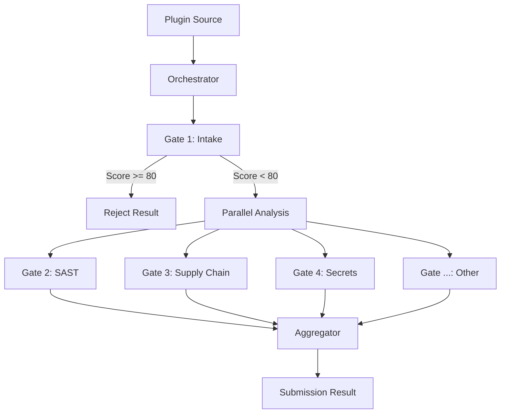

# System Architecture

The Gates Security Pipeline is designed for modularity, speed, and reliability. It manages the lifecycle of a plugin submission through a series of automated checks.

## Pipeline Lifecycle

The orchestrator (`gates/orchestrator.py`) manages the execution flow using a two-phase approach.

### Phase 1: Sequential Blocking (Intake)
The first step is `gate_1` (Intake). This gate performs essential checks like:
- Manifest file existence and schema validation.
- Basic plugin structure integrity.
- Developer identity verification.

**Fail-Fast Logic**: if `gate_1` returns an anomaly score ≥ 80 (Auto-Reject threshold), the pipeline stops immediately. No further analysis is performed to save resources on obviously malicious or broken submissions.

### Phase 2: Parallel Analysis
Once the intake is passed, the orchestrator launches all remaining gates concurrently using `asyncio.gather`. 

```python
tasks = [
    gate_2(self.source_dir), # Static Analysis
    gate_3(self.source_dir), # Supply Chain
    gate_4(self.source_dir), # Secrets
    # ... gates 5 to 9
]
results = await asyncio.gather(*tasks, return_exceptions=True)
```

This ensures that the total execution time is determined by the slowest individual gate rather than the sum of all gate durations.

### Phase 3: Result Aggregation
After all gates complete (or timeout), the orchestrator:
1.  **Aggregates Findings**: Collects all `Finding` objects from all `GateResult` instances.
2.  **Calculates Scores**: Sums the individual gate scores.
3.  **Determines Status**: Maps the total score to a `SubmissionStatus` (`APPROVED`, `MANUAL_REVIEW`, `REJECTED`).
4.  **Generates Recommendation**: Provides a human-readable summary for marketplace moderators.

## Data Flow



## Observability

The pipeline is instrumented with **OpenTelemetry**. Each gate execution and the overall pipeline run are wrapped in spans. This allows developers to:
- Track where time is being spent.
- Identify flaky or slow gates.
- Monitor the success/failure rate of specific analysis rules.

To view traces, ensure an OTLP-compatible collector is configured in your environment.
